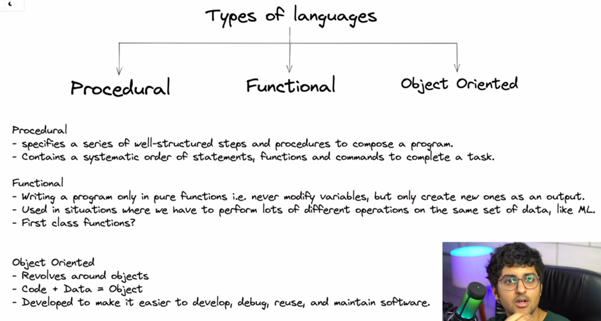
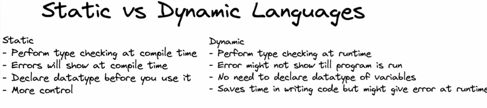
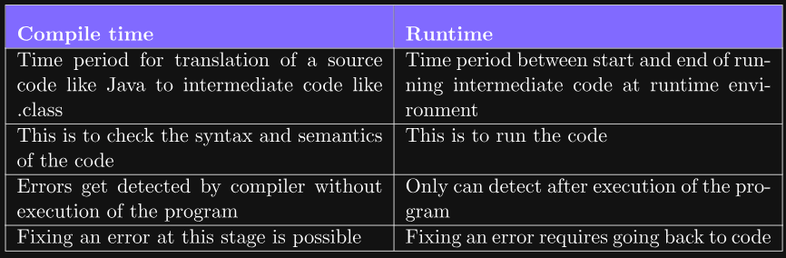
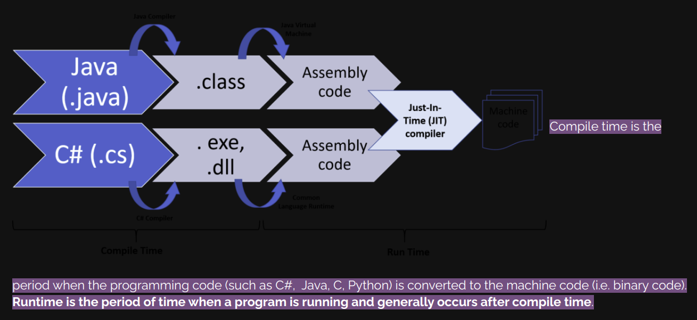

# **Introduction to Programming - Types of Languages, Memory Management**

**Programming** is **the process of writing instructions for a computer to perform tasks**.

---

## Type of Programming Language



---

### Procedural Programming

A procedural programming language is **one that uses sets of functions and commands to complete actions**.  
Examples: BASIC, C, Perl, PHP, Pascal, Rust, and Go.

---

### Functional Programming

Functional programming is designed to handle symbolic computation and application processing, based on mathematical concepts.  
Examples: Python, Lisp, Haskell, Clojure, Erlang, Scala, etc.

---

### Object-Oriented Programming

Object-Oriented Programming (OOP) in Java uses **data structures** called "objects", which combine data and methods, to design applications and computer programs.

OOP is based on the concept of **objects**, which can contain:
- **Data** → Fields (attributes/properties)
- **Code** → Procedures (methods)

**Class** → Named group of properties and functions

> 💡 **CLASS**: A class can be defined as a template/blueprint that describes the behaviour/state that the objects of its type support.

> 💡 **OBJECT**: Objects have states and behaviors. An object is an instance of a class.

> 💡 **METHODS**: A method defines the behavior/action of an object.

---

### Language Support Overview

- **Python** → Supports Procedural, Functional, and OOP paradigms
- **Java & C++** → Support Procedural & OOP paradigms

---

### Static vs Dynamic Language



- **Static Example:** Java  
- **Dynamic Example:** Python

---

### Compilation

Compilation is the process of converting high-level programming language into machine language using a compiler. This is necessary for the computer to understand and execute instructions.





---

### Types of Errors

- **Compile Time Errors**:  
  - **Syntax Errors** → Mistakes in code does not follow syntax rules (e.g., spelling, punctuation, labels)  
  - **Semantic Errors** → Code is syntactically correct but doesn't make logical sense (e.g., invalid variable or type use)

---

## **Memory Management**

In Java, memory is divided into:

- **Stack Memory** → Stores method calls and local variables
- **Heap Memory** → Stores objects, dynamically allocated/deallocated

Example:
```java
int a = 10;
```
a—>reference variable & 10 is object     //a is pointing towards 10

**Stack** —>a or variable

**Heap**—>storing value of variable or object

1. More than one reference variable can point toward same object.
2. If any one of the reference variable change the object then object is going to be change for all variables.
3. I am human but I referred as Kishan for friends but for mom I am pintiya the same body. 

**Garbage collection(Yamraj)** —> If any object doesn’t have any reference variable and garbage hit it will be deleted automatically from memory.