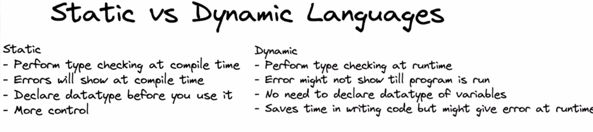
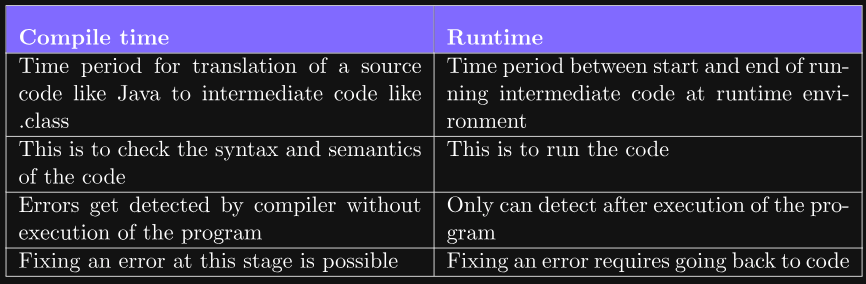

# 📘 Day 01: Introduction to Programming

Today I began my journey in the [DSA Bootcamp by Kunal Kushwaha](https://github.com/kunal-kushwaha/DSA-Bootcamp-Java/).

## 🔧 Topics Covered

### 1. What is Programming?
> Programming is the process of writing instructions for a computer to perform tasks.

---

### 2. Types of Programming Languages

| Type | Description | Examples |
|------|-------------|----------|
| **Procedural** | Uses functions & commands to complete tasks | C, BASIC, Go |
| **Functional** | Based on mathematical functions | Haskell, Lisp, Scala |
| **Object-Oriented** | Uses objects combining data & methods | Java, Python, C++ |

### 3. Object-Oriented Concepts

- **Class**: Template for creating objects
- **Object**: Instance of a class with state & behavior
- **Methods**: Actions or behaviors of an object

> 🧠 _"I am Kishan to my friends and Kaguliya to my mom — same object, different references!"_

---

### 4. Static vs Dynamic Languages

- **Static (Java)**: Variables declared with type
- **Dynamic (Python)**: Types resolved at runtime

---

### 5. Compilation Process

- Converts high-level code to machine code
- Detects errors like:
  - **Syntax errors**: Incorrect grammar
  - **Semantic errors**: Grammatically correct but logically wrong

---

## 🧠 Memory Management in Java

- **Stack**: Stores method calls, local variables
- **Heap**: Stores objects
- Reference variables point to heap memory
- **Garbage Collection**: Automatically deletes unreferenced objects

---

## 📂 Resources

- [Video Link](https://youtu.be/wn49bJOYAZM?si=foBaDbU2JKdd9yKU)
- [Notes](notes.md)
- [Handwritten Notes](Handwritten%20notes%20Introduction%20to%20Programming%20Languages.pdf)
- [Notes](Intro_to_Programming_Notes.pdf)

